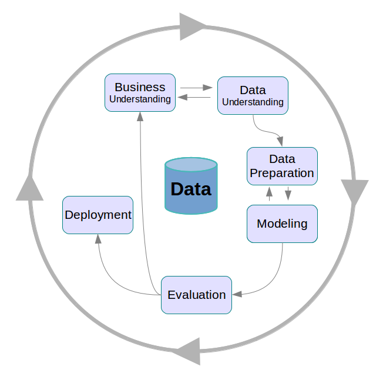

Introduction to dataMineR 
========================================================

Introduction
----------------------
The dataMineR script toolbox aims to be a efficient set of R & knitr scripts, that can be used by experienced and less experience dataminers. The toolbox uses the best of the R community to efficently analayse any arbritray dataset and make a predictive model on the target variable.
The toolbox uses R R version 2.14.1 (2011-12-22), R-studio and [knitr](http://yihui.name/knitr/) to knit R code and Latex into nice and readable pdf reports. We have the option to include all R code that is used to generate the plots and calculations(see "chunk\_options"). Default this feauture is dissabled.

CRoss Industry Standard Process for datamining
--------------------------
In this toolkit we will use the CRISP methodology to guide the datamining proces.

CRISP-DM breaks the process of data mining into six major phases:
* Business Understanding : This initial phase focuses on understanding the project objectives and requirements from a
business perspective, and then converting this knowledge into a data mining problem
definition, and a preliminary project plan designed to achieve the objectives.

* Data Understanding : The data understanding phase starts with an initial data collection and proceeds with activities in order to get familiar with the data, to identify data quality problems, to discover first insights into the data, or to detect interesting subsets to form hypotheses for hidden
information.

* Data Preparation : The data preparation phase covers all activities to construct the final dataset (data that will be fed into the modeling tool(s)) from the initial raw data. Data preparation tasks are likely to be performed multiple times, and not in any prescribed order. Tasks include table, record, and
attribute selection, data cleaning, construction of new attributes, and transformation of data for modeling tools.

* Modelling :
  In this phase, various modeling techniques are selected and applied, and their parameters are
calibrated to optimal values. Typically, there are several techniques for the same data mining
problem type. Some techniques require specific data formats.\\
There is a close link between Data Preparation and Modeling. Often, one realizes data
problems while modeling or one gets ideas for constructing new data.

* Evaluation :
  At this stage in the project you have built one or more models that appear to have high quality,
from a data analysis perspective. Before proceeding to final deployment of the model, it is
important to more thoroughly evaluate the model, and review the steps executed to construct
the model, to be certain it properly achieves the business objectives. A key objective is to
determine if there is some important business issue that has not been sufficiently considered.
At the end of this phase, a decision on the use of the data mining results should be reached.

* Deployment :
  Creation of the model is generally not the end of the project. Usually, the knowledge gained
will need to be organized and presented in a way that the customer can use it. Depending on
the requirements, the deployment phase can be as simple as generating a report or as complex
as implementing a repeatable data mining process. In many cases it will be the user, not the
data analyst, who will carry out the deployment steps. In any case, it is important to
understand up front what actions will need to be carried out in order to actually make use of
the created models.

Business Understanding
--------------------------
**Determine Business Objectives**
- Background 
- Business Objectives
- Business Success Criteria

**Situation Assessment**
- Inventory of Resources Requirements 
- Assumptions and Constraints 
- Risks and Contingencies 
- Terminology 
- Costs and Benefits 

**Determine Data Mining Goal**
- Data Mining Goals 
- Data Mining Success Criteria 

**Produce Project Plan**
- Project Plan 

Initial Asessment of Tools and Techniques 

Data Understanding
-------------------------
**Collect Initial Data**  
Initial Data Collection Report 

**Describe Data**  
Data Description Report 

**Explore Data**  
Data Exploration Report 

**Verify Data Quality**   
Data Quality Report 

Data Preparation
-----------------
**Data Set**  
Data Set Description 

**Select Data**    
Rationale for Inclusion / Exclusion

**Clean Data**  
Data Cleaning Report 

**Construct Data**   
- Derived Attributes  
- Generated Records 
- Integrate Data 
- Merged Data 
- Format Data 
- Reformatted Data 

Modeling
-------------------------
**Select Modeling Technique**  
Modeling Technique  
Modeling Assumptions 

**Generate Test Design**  
Test Design

**Build Model**  
Parameter Settings   
Models  
Model Description   

**Assess Model**  
Model Assessment  
Revised Parameter Settings
  
Evaluation
------------------------------
**Evaluate Results**   
Assessment of Data Mining Results w.r.t. Business Success Criteria  
Approved Models 

**Review Process**  
Review of Process  

**Determine Next Steps**   
List of Possible Actions 

**Decision**  

Deployment
----------------------------
**Plan Deployment**  
Deployment Plan

**Plan Monitoring and Maintenance**  
Monitoring and Maintenance Plan

**Produce Final Report**  
Final Report  
Final Presentation

**Review Project Experience**   
Documentation

Toolkit Scope & Setup
-------------------------
Here we describe the scope of the dataMineR toolkit

### Scope
In this project we pick up the CRISP proces from the "Data Understanding" step. From here we strive to build a as complete as possible, automated proces through the steps of Understanding , Preparation, Modelling and Evaluation in which we end with presenting the datamining results, leaving it to the business user to determine if the Business Goals will be met given the quality of the datamining analysis. 
### Setup
The toolkit is setup using knitr .RnW files for each CRISP stage. Each .Rnw file as a corresponding .R code file. The R code can be run by itself,doing all the calculations in the step.
